<h1 align="center">🧬 Algoritmo Genético como Solução Alternativa para Otimização Multivariada do Cultivo de <i>Tetradesmus obliquus</i></h1>

<p align="center">
  Trabalho de Conclusão de Curso — Bacharelado em Ciência da Computação<br>
  Universidade Católica de Pernambuco (UNICAP) · Recife, 2025
</p>

<p align="center">
  
  
  
  
</p>

<p align="center">
  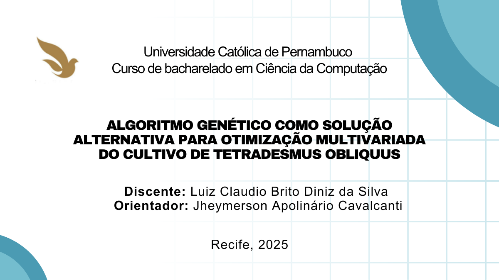
</p>

---

## 📑 Sumário

1. [Sobre o projeto](#-sobre-o-projeto)
2. [Objetivo](#-objetivo)
3. [Problema biológico](#-problema-biológico)
4. [Metodologia](#-metodologia)
5. [SVR — Support Vector Regression](#-svr--support-vector-regression)
6. [Algoritmo Genético](#-algoritmo-genético)
7. [Resultados](#-resultados)
8. [Principais descobertas](#-principais-descobertas)
9. [Limitações e próximos passos](#-limitações-e-próximos-passos)
10. [Tecnologias utilizadas](#️-tecnologias-utilizadas)
11. [Estrutura do repositório](#-estrutura-do-repositório)
12. [Como executar](#-como-executar)
13. [Autor](#-autor)

---

## 🧪 Sobre o projeto

Este projeto propõe um **sistema híbrido de Inteligência Artificial** que combina **Support Vector Regression (SVR)** e **Algoritmo Genético (AG)** para encontrar as melhores condições de cultivo da microalga ***Tetradesmus obliquus*** quando exposta ao inseticida **imidacloprido**.

A ideia central é substituir (ou reduzir) a experimentação exaustiva em laboratório:

1. Um **SVR** aprende, a partir de dados experimentais reais, a prever a **biomassa final** da microalga em função das condições de cultivo.
2. Um **Algoritmo Genético** usa esse SVR como **função de aptidão** e busca, de forma evolutiva, a combinação de parâmetros que **maximiza a biomassa**.

<p align="center">
  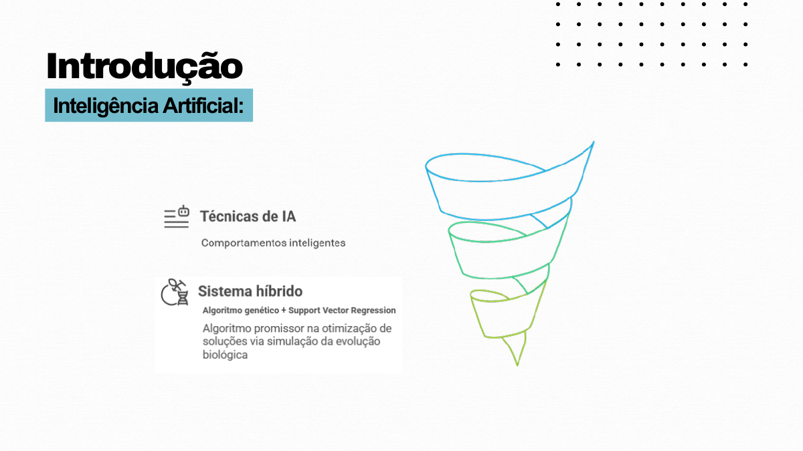
</p>

---

## 🎯 Objetivo

### Objetivo geral

Aplicar o Algoritmo Genético para otimizar as condições de cultivo da microalga *Tetradesmus obliquus*, visando **maximizar a produção de biomassa** na presença de diferentes concentrações do pesticida imidacloprido.

### Objetivos específicos

- Realizar experimentos com *T. obliquus* variando **pH, luminosidade, biomassa inicial, concentração de imidacloprido e dias de cultivo**, construindo uma **base de dados experimental**.
- **Implementar e calibrar** um Algoritmo Genético que utilize essa base para testar combinações de variáveis e identificar as condições ótimas de cultivo.
- **Avaliar o desempenho** do modelo proposto pela predição das condições ideais de crescimento da microalga.

<p align="center">
  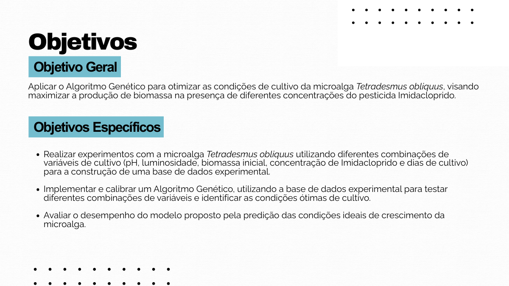
</p>

---

## 🦠 Problema biológico

O **imidacloprido** é um inseticida amplamente utilizado em diversas culturas agrícolas. No Brasil, já foi detectado em ambientes aquáticos em concentrações de **0,059 µg/L a 0,9 mg/L**.

As **microalgas** são organismos eucariontes capazes de crescer em ambientes adversos e, em alguns casos, de utilizar contaminantes como fonte de carbono — o que as torna promissoras para **biorremediação**.

<p align="center">
  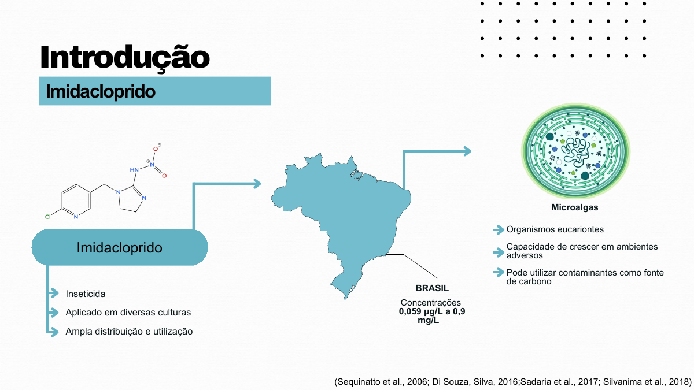
</p>

O crescimento da microalga depende de vários **parâmetros de cultivo** que interagem entre si de forma **não linear**:

<p align="center">
  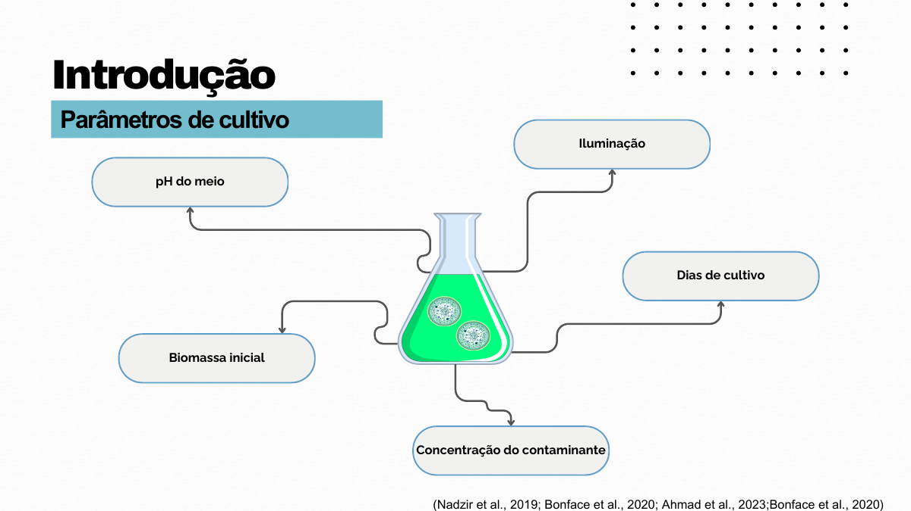
</p>

### Por que não usar apenas os métodos tradicionais?

A Metodologia de Superfície de Resposta (MSR) e os delineamentos experimentais estatísticos (fatoriais, Box-Behnken) são muito usados, porém apresentam **limitações para interações não lineares** e **alto custo experimental**. Os Algoritmos Genéticos oferecem busca mais ampla (ótimo global), lidam bem com não linearidades, não exigem conhecimento prévio do modelo matemático e **reduzem o número de experimentos necessários**.

<p align="center">
  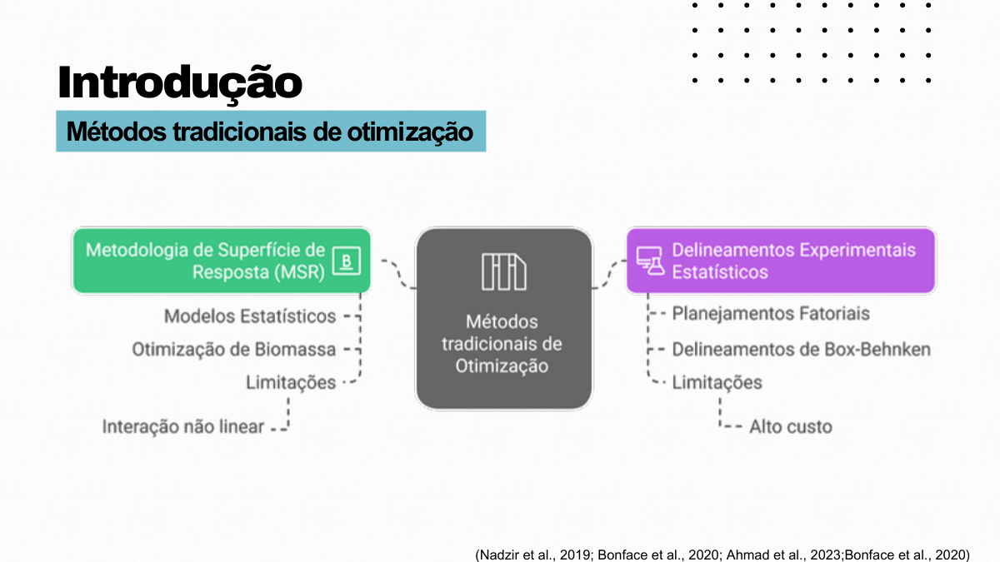
  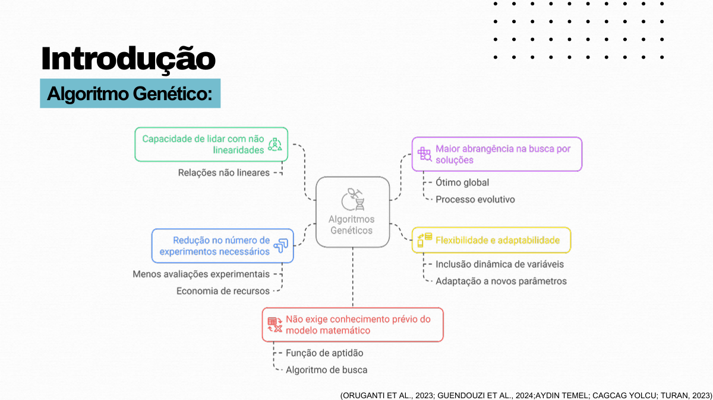
</p>

---

## 🔧 Metodologia

O trabalho foi dividido em quatro etapas:

| Etapa | Descrição |
|:-----:|-----------|
| **01** | **Revisão de literatura** (IEEE, PubMed e Scopus) para seleção dos parâmetros de cultivo |
| **02** | **Cultivo e construção da base de dados** em laboratório |
| **03** | **Treinamento e validação do SVR** (função de aptidão) |
| **04** | **Algoritmo Genético** guiado pelo SVR |

### 🧫 Cultivo e base de dados

Cultivos realizados no **Laboratório de Cultivo de Células — Nubiotec/UFRPE**.

| Item | Detalhe |
|------|---------|
| Espécie | *Tetradesmus obliquus* (Sisgen A5F5402) |
| Contaminante | Imidacloprido (Evidence Bayer®) |
| Meio de cultivo | BG-11 |
| Aeração | Constante |
| Temperatura | 27 °C |

**Variáveis experimentais avaliadas:**

| Variável | Unidade | Intervalo experimental |
|----------|:-------:|------------------------|
| pH | — | 6,0 · 7,0 · 8,0 · 9,0 |
| Luminosidade | lux | 1000 · 2000 |
| Concentração inicial de biomassa | mg L⁻¹ | 25 · 50 · 100 · 200 |
| Tempo de cultivo | dias | 5 · 10 · 15 · 20 |
| Concentração inicial de imidacloprido | mg L⁻¹ | 0 · 0,2 · 0,4 · 0,8 |

Ao todo, a base experimental reúne **200 amostras**.

<p align="center">
  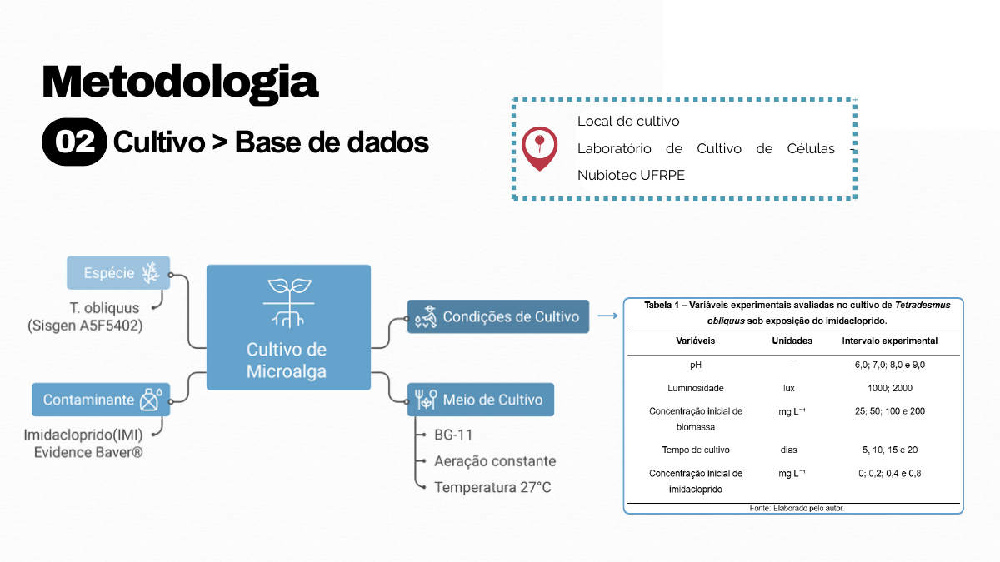
</p>

---

## 🤖 SVR — Support Vector Regression

O **SVR** é a extensão do SVM para problemas de regressão. Com o **kernel RBF**, ele captura relações **não lineares** entre as variáveis de cultivo e a biomassa final. Seus hiperparâmetros principais são:

- **C** — equilíbrio entre erro e complexidade do modelo;
- **γ (gamma)** — alcance de influência de cada ponto;
- **ε (epsilon)** — largura da margem de tolerância onde erros não são penalizados.

<p align="center">
  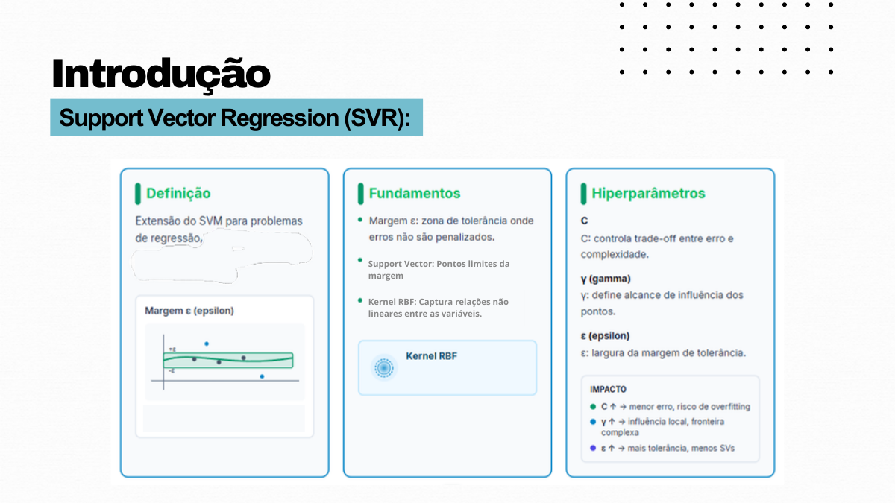
</p>

### Pipeline de treinamento

1. **Normalização** dos dados com `StandardScaler`
2. **Ajuste de hiperparâmetros** com `GridSearchCV`
   - `C` ∈ [2300 … 3250]
   - `ε` ∈ {0.001, 0.01, 0.1, 0.9}
   - `γ` ∈ {`"scale"`, `"auto"`}
   - `kernel = "rbf"`
3. **Treinamento** com divisão **80 % treino / 20 % teste**
4. **Filtragem de outliers** pelo intervalo de confiança dos resíduos:
   `IC = média(resíduos) ± 1,8 · desvio padrão` (≈ 90 % de confiança)

**Melhores hiperparâmetros encontrados:** `C = 2300`, `ε = 0.9`, `γ = "scale"`, `kernel = "rbf"`.

<p align="center">
  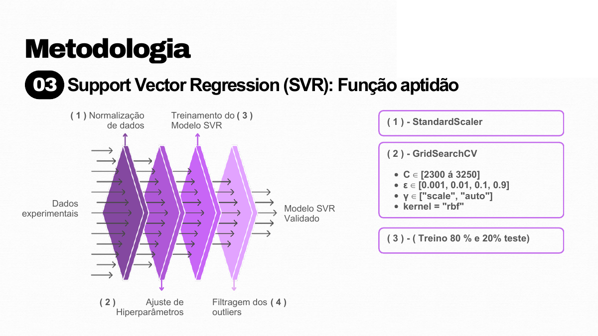
  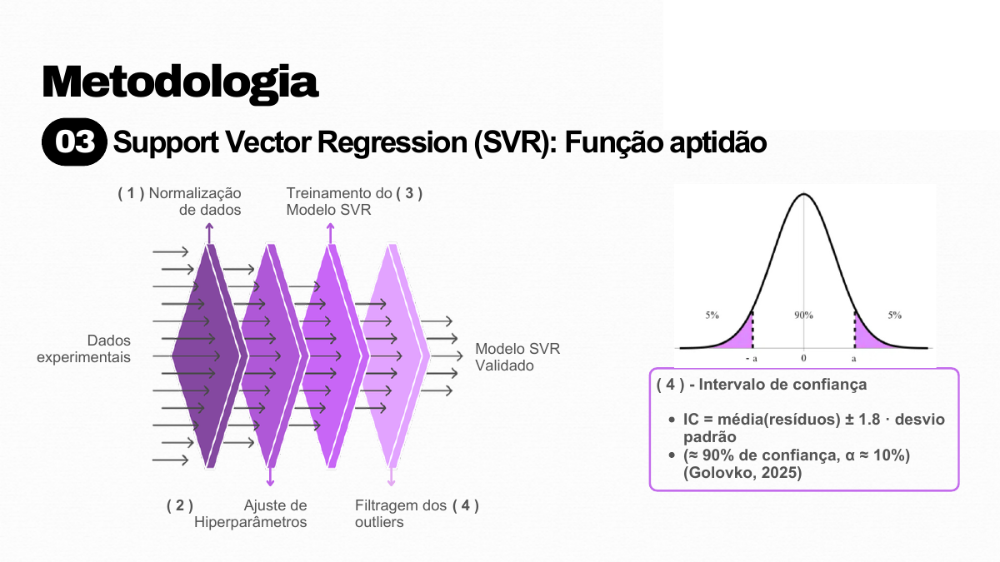
</p>

---

## 🧬 Algoritmo Genético

O AG simula a evolução biológica: uma população de soluções candidatas é avaliada, selecionada, recombinada e mutada ao longo de gerações, preservando as melhores soluções.

<p align="center">
  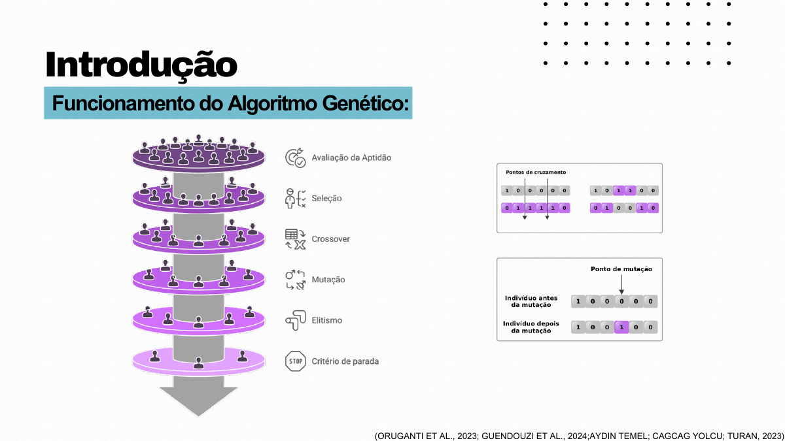
</p>

### Configuração utilizada

| Componente | Configuração |
|------------|--------------|
| **Indivíduo** | Vetor com 5 variáveis contínuas: pH, luz, biomassa inicial, dias e pesticida |
| **População** | 100 indivíduos por geração |
| **Critério de parada** | Até 1000 gerações |
| **Seleção** | Torneio |
| **Crossover** | Um ponto · taxa de **0,8** |
| **Mutação** | Gaussiana · taxa de **0,2** |
| **Elitismo** | Preservação dos melhores indivíduos de cada geração |
| **Função de aptidão** | Biomassa prevista pelo SVR treinado e filtrado |

<p align="center">
  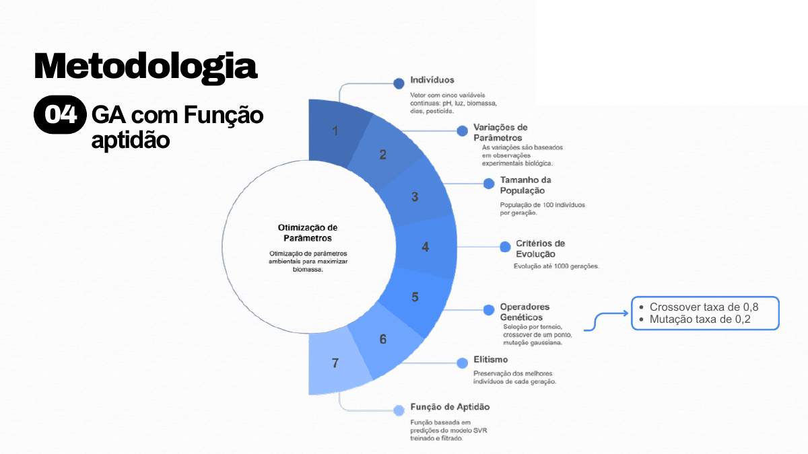
</p>

---

## 📈 Resultados

### 1. Desempenho do SVR

Antes da filtragem de outliers:

| Métrica | Valor |
|:-------:|:-----:|
| MAE | 255,37 |
| RMSE | 382,64 |
| R² | 0,5432 |

<p align="center">
  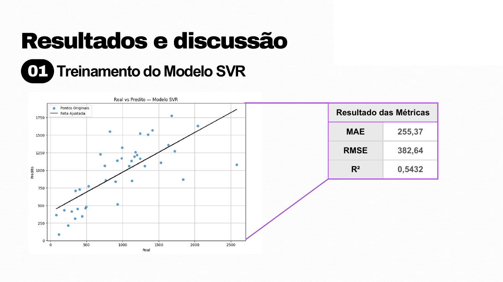
  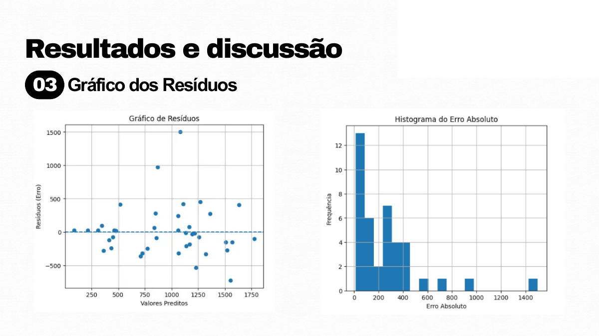
</p>

### 2. Efeito da filtragem de outliers

| Métrica | Sem filtragem | Com filtragem | Variação |
|:-------:|:-------------:|:-------------:|:--------:|
| MAE | 255,37 | **189,60** | −25,75 % |
| RMSE | 382,64 | **240,01** | −37,28 % |
| R² | 0,5432 | **0,7701** | +41,77 % |

<p align="center">
  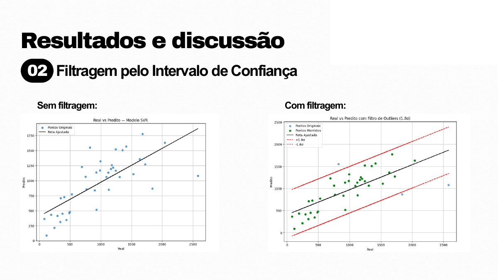
</p>

### 3. Convergência do AG

O AG **estabilizou na geração 158**, e a melhor solução foi registrada na **geração 919**.

<p align="center">
  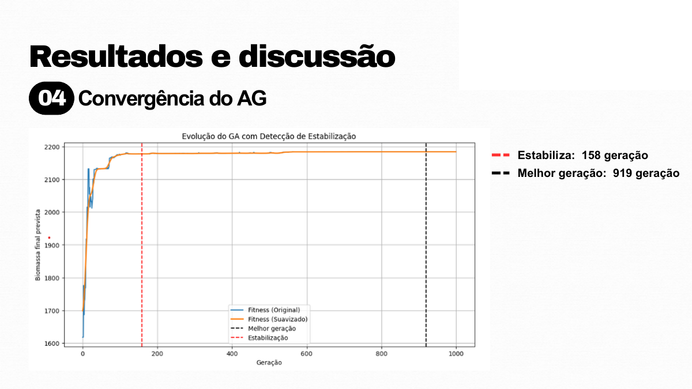
</p>

### 4. Melhor condição de cultivo encontrada

| Parâmetro | Valor ótimo |
|-----------|:-----------:|
| Biomassa inicial | 25,01 mg L⁻¹ |
| Luminosidade | 1146,59 lux |
| pH | 8,987 |
| Imidacloprido | 0,000816 mg L⁻¹ |
| Tempo de cultivo | 19,98 dias |
| **Biomassa final prevista (SVR)** | **2183,48 mg L⁻¹** |

Comparação com os dados experimentais:

| Métrica | Valor (mg L⁻¹) |
|---------|:--------------:|
| Média da biomassa final (dataset) | 910,70 |
| Máxima biomassa experimental observada | 4323,91 |
| Biomassa prevista pelo SVR para a melhor solução do AG | 2183,48 |
| Melhoria em relação à média | **+139,7 %** |
| Percentual do valor máximo experimental | **50,5 %** |

<p align="center">
  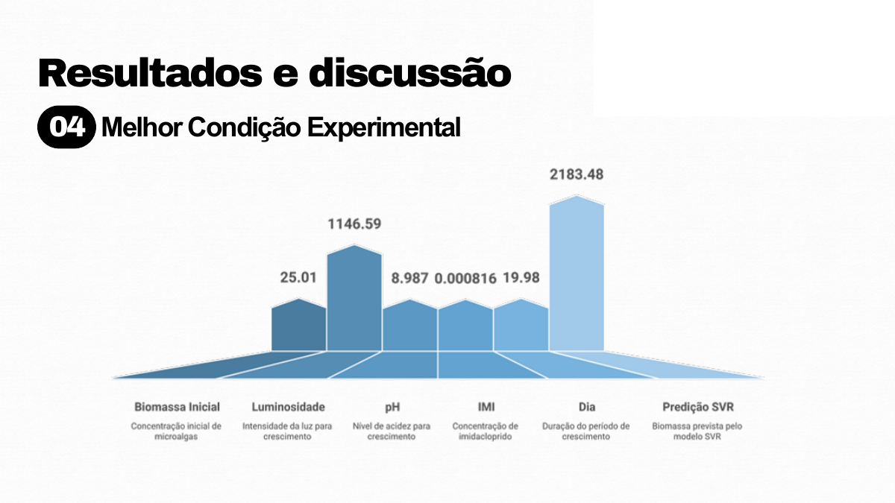
  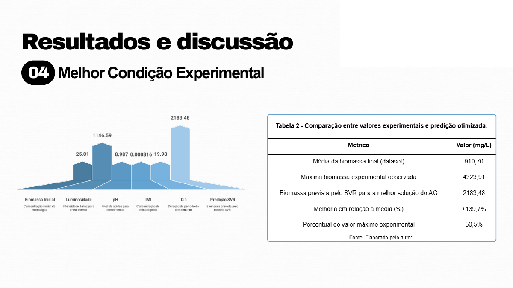
</p>

O valor máximo experimental (4323,91 mg L⁻¹, amostra nº 83) foi identificado como **outlier** e tratado pela estratégia de filtragem, priorizando padrões consistentes e evitando ruídos.

<p align="center">
  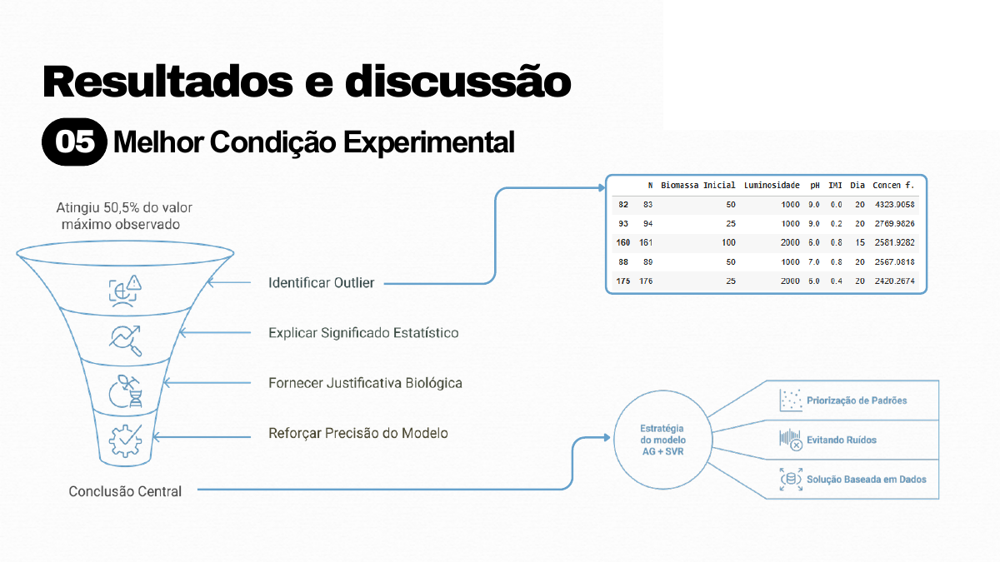
</p>

---

## 🔬 Principais descobertas

- 🧫 Foi construída uma **base experimental com 200 amostras** de *T. obliquus* sob variação de cinco parâmetros.
- 🧹 A **filtragem de outliers** pelo intervalo de confiança elevou o R² do SVR de **0,54 para 0,77** e reduziu o RMSE em **37 %**.
- 🧬 O **AG convergiu rapidamente** (estabilização na geração 158) para condições ótimas de crescimento.
- 🌱 A condição ótima prevista combina **pH ≈ 9**, **biomassa inicial baixa (≈ 25 mg/L)**, **≈ 20 dias** de cultivo e **concentração de imidacloprido praticamente nula**, com biomassa prevista **139,7 % acima da média** do dataset.
- 💸 A abordagem **reduz a necessidade de experimentação extensa** e oferece suporte robusto à tomada de decisão na otimização de cultivos.

<p align="center">
  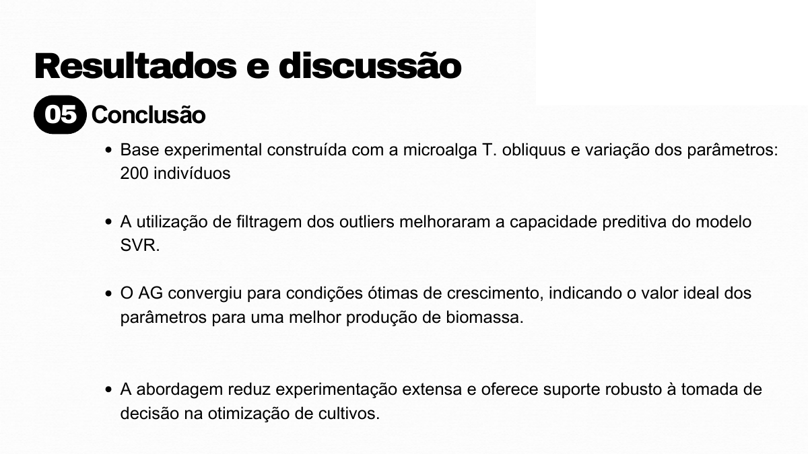
</p>

---

## 🚧 Limitações e próximos passos

- A condição ótima é uma **predição do modelo**; a **validação experimental em laboratório** é o passo natural seguinte.
- O SVR foi treinado com **200 amostras**; ampliar a base tende a melhorar a generalização.
- Vários valores ótimos ficaram **próximos aos limites do intervalo experimental** (biomassa inicial ≈ 25 mg/L, ≈ 20 dias, imidacloprido ≈ 0), sugerindo que **estender a faixa de busca** pode revelar condições ainda melhores.
- Comparar o AG com outras metaheurísticas (PSO, evolução diferencial) e com a MSR clássica.

---

## 🛠️ Tecnologias utilizadas

- **Python**
- **scikit-learn** — `SVR`, `StandardScaler`, `GridSearchCV`
- **NumPy** e **pandas** — manipulação dos dados
- **Matplotlib** — gráficos
- **Algoritmo Genético** (implementação própria)

---

## 📂 Estrutura do repositório

```text
.
├── README.md
├── imagens/          # Slides da defesa usados neste README
├── dados/            # Base experimental (200 amostras)
├── src/              # Código do SVR e do Algoritmo Genético
├── notebooks/        # Análises e gráficos
└── docs/             # Monografia e apresentação da defesa
```

> Ajuste a estrutura acima conforme os arquivos reais do seu projeto.

---

## ▶️ Como executar

```bash
# 1. Clone o repositório
git clone https://github.com/SEU-USUARIO/NOME-DO-REPOSITORIO.git
cd NOME-DO-REPOSITORIO

# 2. (Opcional) Crie um ambiente virtual
python -m venv venv
source venv/bin/activate      # Windows: venv\Scripts\activate

# 3. Instale as dependências
pip install -r requirements.txt

# 4. Execute
python src/main.py
```

---

## 👨‍💻 Autor

**Luiz Claudio Brito Diniz da Silva**
Bacharelando em Ciência da Computação — Universidade Católica de Pernambuco

🔗 [LinkedIn](https://www.linkedin.com/in/SEU-PERFIL) · 💻 [GitHub](https://github.com/SEU-USUARIO) · ✉️ seu-email@exemplo.com

**Orientador:** Jheymerson Apolinário Cavalcanti

### 🙏 Agradecimentos

Universidade Católica de Pernambuco (UNICAP), Universidade Federal Rural de Pernambuco (UFRPE — Nubiotec) e LABTECBIO.

---

<p align="center">Feito com 🧬 e 🐍 em Recife, 2025</p>
